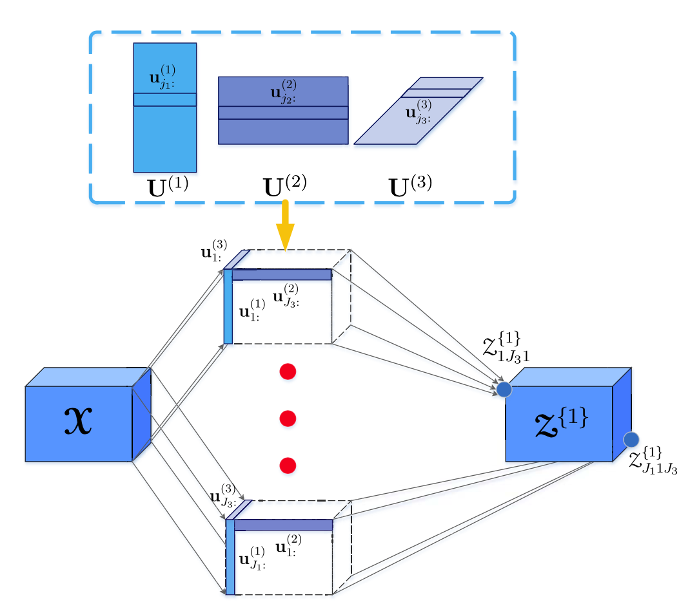

# Tensor-Factorized Neural Network (TFNN)

##背景

深度学习模型虽然能够学习很多数据的抽象特征，但是现有的深度学习方法都是以向量作为输入的。向量化的操作使得很多多模态的数据损失了它们原有的结构信息。因此，作者认为，我们急需研究一种能够学习到高维度数据结构信息的深度学习模型。

## 回顾

张量Tucker分解模型：

我们知道，Tucker分解能够将一个$N$阶张量$\mathcal{X} \in \mathbb{R}^{J_1 \times J_2 \times \cdot \cdot \cdot J_N}$分解成一个核张量(core tensor)和$N$个因子矩阵(factor matrices)的形式，形如：
$$
\mathcal{X} = \mathcal{A} \times_1 \mathbf{U}^{(1)} \times_2 \mathbf{U}^{(2)} \times_3 \cdot \cdot \cdot \times_N \mathbf{U}^{(N)}
$$
也可以写成如下逐元素的形式：
$$
x_{i_1 i_2 ... i_N} = \sum_{j_1 = 1}^{J_1} \sum_{j_2 = 1}^{J_2} \cdot \cdot \cdot \sum_{j_N = 1} ^{J_N} {a}_{j_1 j_2 \cdot \cdot \cdot j_N} u_{i_1 j_1}^{(1) } u_{i_2 j_2}^{(2)} \cdot \cdot \cdot u_{i_N j_N}^{(N)}
$$
如果我们写成逆的形式，Tucker分解可以写成：
$$
\mathcal{A} = \mathcal{X} \times_1 \mathbf{U}^{(1) \dagger} \times_2 \mathbf{U}^{(2) \dagger}  \times_3 \cdot \cdot \cdot \times_N  \mathbf{U}^{(N) \dagger}
$$
(3)给了我们一个启发，那就是张量$\mathcal{A}$可以看作是张量$\mathcal{X}$的一个压缩形式，或者我们也可以将它看作一个在不同维度都作了降维的特征张量。

以上，便是这篇文章的中心思想。

## 建立模型

### TFNN的由来

建立如下模型

上图中，(a)是上输入为向量时的神经网络模型(即MLP)，(b)为输入二维情况下(有区别于矩阵分解模型)，(c)为输入为三维的情况下。

我们以三维数据输入为例子，我们可以得到张量Tucker分解和神经网络模型结合的形式：

模型前向运算步骤：

1. 随机化因子矩阵$\left \{ {\mathbf{U}^{(1)}},\mathbf{U}^{(2)},\mathbf{U}^{(3)} \right \}$，并求取核张量$\mathcal{A}^{1}$；
2. 通过非线性激活函数$h(\cdot)$激活得到$\mathcal{Z}^{(1)}$;
3. 继续求取下一层;
4. 权重张量$\mathcal{W}$将最后一层张量映射到向量的形式，经过软最大化(softmax)后，得到预测标签$\mathbf{y}$.

### TFNN前向计算过程

分两种情况讨论，分别是隐藏层单元和输出层单元。

#### 计算隐藏层神经单元

给出Tucker分解的形式：
$$
\mathcal{A}^{1}  = \mathcal{X} \times_1 \mathbf{U}^{(1)} \times_2 \mathbf{U}^{(2)} \times_3 \cdots \times_N \mathbf{U}^{(N)} \\
 = \sum_{i_1, i_2,...,i_N}{\mathcal{X}_{i_1,i_2,...,i_N} (\mathbf{u}_{i_1}^{(1)} \circ \mathbf{u}_{i_2}^{(2)} \circ \cdots \circ \mathbf{u}_{jN}^{(N)})}
$$
或者，对于逐元素而言，我们也可以给两个内积的形式：
$$
\mathcal{A}_{j_1 j_2 ... j_N}^{1} = \langle \mathcal{X}, (\mathbf{u}_{i_1}^{(1)} \circ \mathbf{u}_{i_2}^{(2)} \circ \cdots \circ \mathbf{u}_{jN}^{(N)}) \rangle
$$
对于以上运算，我们可以用图进行如下表示：

通过上图，我们可以发现，TFNN可以理解为一种高维模型的MLP，同样使用权重和输入作了内积后激活；但是有两点不同的是：1.这里的权重张量都是由三个矩阵(即$U^{(1)}, U^{(2)},U^{(3)}$)的行向量进行外积而构成；2.

#### 计算输出层单元

对于最后一层，参数张量$\mathcal{W}$的参数不再进行权值共享，即不再有一系列$\mathbf{U}$矩阵的行向量来进行外积。并且如果我们有$C$个类别，那么也就有$C$个权重张量$\mathcal{W}$。因此，对于第$c$个输出$a_{c}^{\left \{ l \right \}} = \langle \mathcal{W}_c, \mathcal{Z}^{ \left \{l-1 \right \} } \rangle$ 。通过软最大化，得到预测值：
$$
\mathbf{y}  = s(\mathbf{a}^{\left \{ l\right \}}) = \frac{\text{exp}(\mathbf{a}^{\left \{l \right \}}) }{\sum_{c=1}^{C} \text{exp}(a_c^{ \left \{ l \right \}})}
$$
对于整个两层张量分解网络而言，我们共有参数$\Theta = \left \{ \mathbf{U}^{(n)}, \mathbf{V}^{(n)}, \mathcal{W} \right \}$。因此，对于交叉熵损失函数：
$$
E(\Theta) = - \sum_{c=1}^C r_c \ln y_c
$$

### TFNN反向传播计算过程

常规的链式法则与求导计算，这里不再提及。

###算法流程图

### CTFNN

作者认为，TFNN也可以推广到CNN网络，提出了Convolutional TFNN (CTFNN)。与TFNN类似，层与层的连接不再是一个全连接，而是一个局部连接。在CTFNN中，每一个局部的连接也可以用Tucker分解的形式来表示。如下图所示：

对于每一个小的卷积核张量，

### 实验部分

有几部分实验，分别是：

1. MNIST训练时的损失：

   

   其中(a)代表MLP的参数可视化，(b)代表TFNN的参数可视化。可以看出，(b)的参数更为稀疏。(c)代表训练过程的损失。

2. CNN卷积核大小等参数的确定

   

   其中两个权重矩阵的大小都为$4 \times 5$ . 为了比较的公平起见，作者选择的卷积核大小为$5\times 5$.

3. MNIST计算时间和测试错误率：

   

4. SVHN的计算时间和测试错误率：

   

5. CIFAR-10的计算时间和测试错误率：

   

6. IDIAP数据集的计算时间和测试错误率:

   

